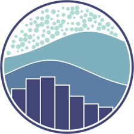
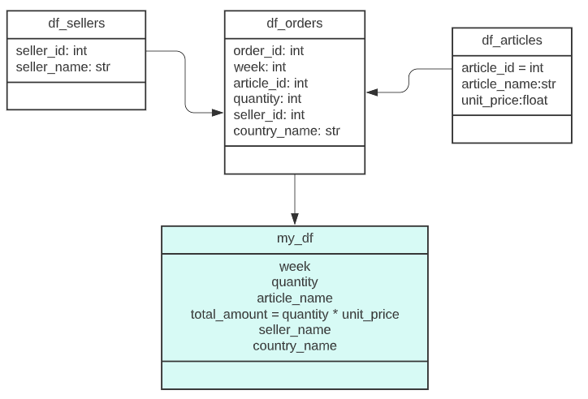

<!-- PROJECT LOGO -->
 

  

<h1 align="center">Data Science Course Final Project</h1>

  

    This is the final Project of the Data Science course I took a while back. It is focused on integrating 3 different data sources into 1 final dataframe where different questions for analysis are made. It was created using mainly Python (Pandas, Numpy, Matplotlib and Seaborn. Databases were Excel, cvs and SQL.
     
    <a href="https://github.com/Daltonag1/Tech_Survey_Dashboard"><strong>Explore the docs »</strong></a>

  

<!-- ABOUT THE PROJECT -->
## About The Project
 

 In this Project, we will try and anlyze the sales of a company, indentifying it's pros and cons, the advantages and disadvantages and were we can try and make improvements.
This project was the final assignment I had to create for a Data Science course I did a year back.

(<a href="#readme-top">back to top</a>)

## Built With

(<a href="#readme-top">back to top</a>)

<!-- GETTING STARTED -->
## Data Transformation / Cleaning
#### All data transformation and cleaning was made using pandas and numpy. the goal was to achieve the following dataframe:

(<a href="#readme-top">back to top</a>)

## Analyzing the Dataframe and visualizations

#### The following questions are the ones being analyzed. Needless to say, there's much more metrics that we can analyze, but we can have a pretty good overview of what the dataframe has to offer:

- What is the best selling item (units)?

 

- What item is the one that gave us the most income?

     
- Which seller should be awarded the "Best seller of the Month" bonus?

    
- Are there large variations in sales throughout the month?

    
- What are the 5 countries that generated the most sales? And the 5 that sold the most?

    
- What are the items that the best seller sold? What countries did he sell to?

    

- What is the country that generates the least sales?

(<a href="#readme-top">back to top</a>)

## Conclusions and Proposals
#### Looking at the results, here's some of the conclusions we can get:

Sales broken down by item are good in all sectors. While we have a clear 'winner' product (HDD), the rest are selling almost on par in terms of quantity.

If we focus on a country level, we can notice a clear difference between Brazil and the rest (both in amounts and quantity). Furthermore, we can notice something similar when comparing the 5 countries that sell the most with the rest. This gap could be related to the economic power of each of them. Taking this into account, it was possible to see the low level of sales from Puerto Rico, with a total of 12 sales. The difference is even greater if we take into account that the next in line is Uruguay with 92 sales.

Regarding weekly sales, we can notice a clear decline between the first week and the last. This is clearly given by the amount of money that potential customers have as the month goes by. Greater amount in the first week (salary collection) and less at the end of the month due to expenses throughout the month.

Finally, we note that Janel O'Curran has been the best seller by a wide margin, approximately $50,000 and 300 units more than Brockie Patience, who ranks second.

My advice and proposals would be the following:

    - Keep the products as they are. They are sold at par and in good quantities.
    
    - Cease operations in Puerto Rico. It is not profitable to maintain an operation in the country considering that it sells extremely low quantities and a lot more than the rest.
    
    - Offer promotions, discounts or purchases in installments in the last week of the month. This will help raise sales. Bundles could be made with the products that sell less with those that sell the most, to level out the curve.
    
    - Try to replicate Janel O'Curran's sales strategy to the rest of the sellers. He is clearly the best seller by a wide margin and applying his sales experience to others is going to be extremely profitable.

(<a href="#readme-top">back to top</a>)

<!-- CONTRIBUTING -->
## Contributing

Contributions are what make the open source community such an amazing place to learn, inspire, and create. Any contributions you make are **greatly appreciated**.

If you have a suggestion that would make this better, please fork the repo and create a pull request. You can also simply open an issue with the tag "enhancement".
Don't forget to give the project a star! Thanks again!

1. Fork the Project
2. Create your Feature Branch (`git checkout -b feature/AmazingFeature`)
3. Commit your Changes (`git commit -m 'Add some AmazingFeature'`)
4. Push to the Branch (`git push origin feature/AmazingFeature`)
5. Open a Pull Request

(<a href="#readme-top">back to top</a>)

<!-- CONTACT -->
## Contact

Agustin Dalton - agustindalton@gmail.com

Project Link: [https://github.com/Daltonag1/Tech_Survey_Dashboard](https://github.com/Daltonag1/Tech_Survey_Dashboard)

(<a href="#readme-top">back to top</a>)

